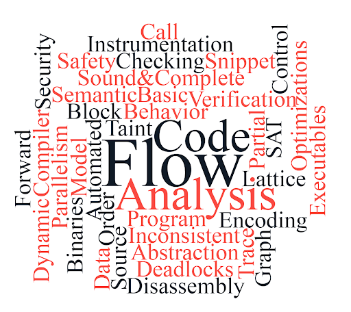

# Parallel Program Analysis (CS 6235 : Spring '21)

  

This repo contains the solutions to all programming assignments completed as part of a static program analysis course conducted by Prof. [V. Krishna Nandivada](http://www.cse.iitm.ac.in/~krishna/), IIT Madras.   
There are 3 assignments in total. Their description is as follows.   

- [A1](a1) is a written assignment which contains Java snippets for understanding various parallelism concepts. The corresponding [report](a1/report.pdf) covers dataraces, deadlocks, Happens-Before relations (according to the [Java Memory Model](https://docs.oracle.com/javase/specs/jls/se7/html/jls-17.html#jls-17.4)) along with code and benchmarks for verification of Amdahl's law

- [AliasAnalysis](AliasAnalysis) contains code which performs flow insensitive May-Alias Analysis for a subset of Java programs. More details can be found [here](AliasAnalysis/README.md).

- [MHPAnalysis](MHPAnalysis) contains code which performs MHP(May Happen in Parallel) analysis for a subset of Java programs. More details can be found at [here](MHPAnalysis/README.md)

Both [AliasAnalysis](AliasAnalysis) and [MHPAnalysis](MHPAnalysis) have a bunch of sample testcases and an associated parallel testing script for testing(which uses [GNU Parallel](https://www.gnu.org/software/parallel/)).   
[Apache Ant](https://ant.apache.org/) is used to build both projects into a corresponding executable `jar` file.